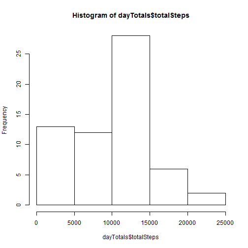
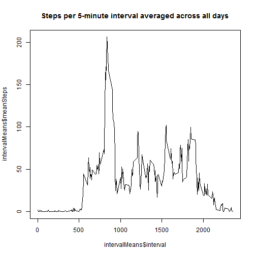
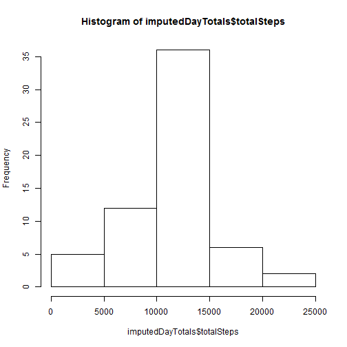
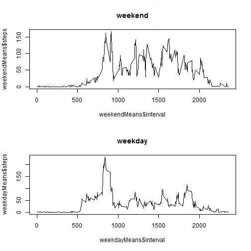

## Loading and preprocessing the data

The data can be read directly from the zip file provided using 'unz':


```r
activity <- read.csv(unz('activity.zip', 'activity.csv'))
```

No processing/transformation appears to be needed.

## What is mean total number of steps taken per day?

Total number of steps taken per day:


```r
dayTotals <- aggregate(activity$steps, list(date=activity$date), sum, na.rm=T)
names(dayTotals) <- c("date", "totalSteps")
print(dayTotals)
```

```
##          date totalSteps
## 1  2012-10-01          0
## 2  2012-10-02        126
## 3  2012-10-03      11352
## 4  2012-10-04      12116
## 5  2012-10-05      13294
## 6  2012-10-06      15420
## 7  2012-10-07      11015
## 8  2012-10-08          0
## 9  2012-10-09      12811
## 10 2012-10-10       9900
## 11 2012-10-11      10304
## 12 2012-10-12      17382
## 13 2012-10-13      12426
## 14 2012-10-14      15098
## 15 2012-10-15      10139
## 16 2012-10-16      15084
## 17 2012-10-17      13452
## 18 2012-10-18      10056
## 19 2012-10-19      11829
## 20 2012-10-20      10395
## 21 2012-10-21       8821
## 22 2012-10-22      13460
## 23 2012-10-23       8918
## 24 2012-10-24       8355
## 25 2012-10-25       2492
## 26 2012-10-26       6778
## 27 2012-10-27      10119
## 28 2012-10-28      11458
## 29 2012-10-29       5018
## 30 2012-10-30       9819
## 31 2012-10-31      15414
## 32 2012-11-01          0
## 33 2012-11-02      10600
## 34 2012-11-03      10571
## 35 2012-11-04          0
## 36 2012-11-05      10439
## 37 2012-11-06       8334
## 38 2012-11-07      12883
## 39 2012-11-08       3219
## 40 2012-11-09          0
## 41 2012-11-10          0
## 42 2012-11-11      12608
## 43 2012-11-12      10765
## 44 2012-11-13       7336
## 45 2012-11-14          0
## 46 2012-11-15         41
## 47 2012-11-16       5441
## 48 2012-11-17      14339
## 49 2012-11-18      15110
## 50 2012-11-19       8841
## 51 2012-11-20       4472
## 52 2012-11-21      12787
## 53 2012-11-22      20427
## 54 2012-11-23      21194
## 55 2012-11-24      14478
## 56 2012-11-25      11834
## 57 2012-11-26      11162
## 58 2012-11-27      13646
## 59 2012-11-28      10183
## 60 2012-11-29       7047
## 61 2012-11-30          0
```

Histogram of the total number of steps taken each day:


```r
hist(dayTotals$totalSteps)
```

 

Mean and median of the total number of steps taken per day:


```r
mean(dayTotals$totalSteps)
```

```
## [1] 9354.23
```

```r
median(dayTotals$totalSteps)
```

```
## [1] 10395
```

## What is the average daily activity pattern?


```r
intervalMeans <- aggregate(activity$steps, list(interval=activity$interval), mean, na.rm=T)
names(intervalMeans) <- c("interval", "meanSteps")
plot(intervalMeans$interval, intervalMeans$meanSteps, type="l",
     main="Steps per 5-minute interval averaged across all days")
```

 

The interval with the maximum number of steps is:


```r
max.steps <- max(intervalMeans$meanSteps)
filteredInterval <- intervalMeans[intervalMeans$meanSteps == max.steps, ]
print(filteredInterval)
```

```
##     interval meanSteps
## 104      835  206.1698
```

```r
print(filteredInterval$interval)
```

```
## [1] 835
```


## Imputing missing values

Total number of rows with NAs:


```r
sum(!complete.cases(activity))
```

```
## [1] 2304
```

The missing values only appear in "steps". The strategy used to fill them in will be to replace each one with thr mean for the corresponding 5-minute interval as calculated above (in intervalMeans):


```r
imputed = activity
for(i in seq_len(nrow(imputed))) {
  if(is.na(imputed$steps[i])) {
    thisInterval <- imputed$interval[i]
    replacementValue <- (intervalMeans[intervalMeans$interval==thisInterval,])$meanSteps
    imputed$steps[i] <- replacementValue
  }
}
```

Now *imputed* is equal to  *activity* but with missing values filled in.

A histogram of number of steps taken per day, and the mean and median, are given below:


```r
imputedDayTotals <- aggregate(imputed$steps, list(date=imputed$date), sum)
names(imputedDayTotals) <- c("date", "totalSteps")
hist(imputedDayTotals$totalSteps)
```

 

```r
mean(imputedDayTotals$totalSteps)
```

```
## [1] 10766.19
```

```r
median(imputedDayTotals$totalSteps)
```

```
## [1] 10766.19
```

The values clearly differ from the estimates in the from the first part of the assignment. The histogram is more symmetrical with the first bar (0-5000) being clearly smaller. The mean and median are both greater than before. The new mean and median are equal to each other which is a suprising coincidence (we would expect them to be similar as the histogram is fairly symmetrical we not exactly equal).

The main impact of imputing missing data has been remove the effect of days when little or no data was collected, which is why the first bar of the histogram has become a lot smaller.

## Are there differences in activity patterns between weekdays and weekends?

Adding new factor variable with levels "weekday" and "weekend" to *imputed*:


```r
daysOfWeek = weekdays(as.Date(imputed$date))
isWeekend <- daysOfWeek=="Saturday" | daysOfWeek=="Sunday"
imputed$weekend = as.factor(ifelse(isWeekend, "weekend", "weekday"))
summary(imputed)
```

```
##      steps                date          interval         weekend     
##  Min.   :  0.00   2012-10-01:  288   Min.   :   0.0   weekday:12960  
##  1st Qu.:  0.00   2012-10-02:  288   1st Qu.: 588.8   weekend: 4608  
##  Median :  0.00   2012-10-03:  288   Median :1177.5                  
##  Mean   : 37.38   2012-10-04:  288   Mean   :1177.5                  
##  3rd Qu.: 27.00   2012-10-05:  288   3rd Qu.:1766.2                  
##  Max.   :806.00   2012-10-06:  288   Max.   :2355.0                  
##                   (Other)   :15840
```

To create a panel plot using R's basic graphics, I define a function that returns the mean steps for each interval for a given data frame, and then called it for two different filtered versions of *imputed*, then plot both results.:


```r
meanStepsPerInterval <- function(df) {
  means <- aggregate(df$steps, list(interval=df$interval), mean, na.rm=T)
  names(means) <- c("interval", "steps")
  means
}

weekdayMeans <- meanStepsPerInterval(imputed[imputed$weekend == 'weekday',])
weekendMeans <- meanStepsPerInterval(imputed[imputed$weekend == 'weekend',])

par(mfrow=c(2,1))
plot(weekendMeans$interval, weekendMeans$steps, type="l", main="weekend")
plot(weekdayMeans$interval, weekdayMeans$steps, type="l", main="weekday")
```

 
